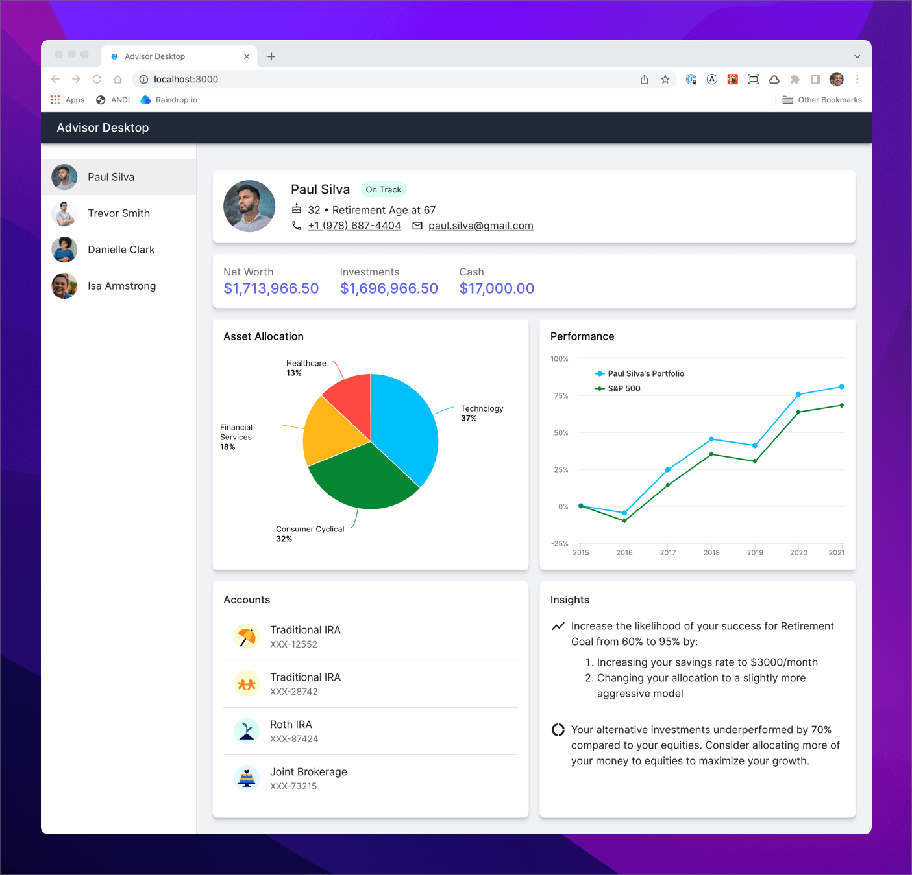

# Advisor Desktop using Microfrontends

Sample application to demonstrate microfrontend architectures.



## Development Build

To develop all apps and packages, run the following command:

```
npm install
npm run dev
```

Open two browser windows and point them to the following URLs:

1. http://localhost:3000/: Monolithic version
2. http://localhost:4000/: Microfrontend version using route splitting (not
   started)
3. http://localhost:5000/: Microfrontend version module federation (work in
   progress)

> Note: Do not run `npm install` in any of the subdirectories. It will break the
> build. There should be only one `package-lock.json` file in the entire repo
> (at the root).

## Production Build

To build all apps and packages, run the following command:

```
npm install
npm run build
```
